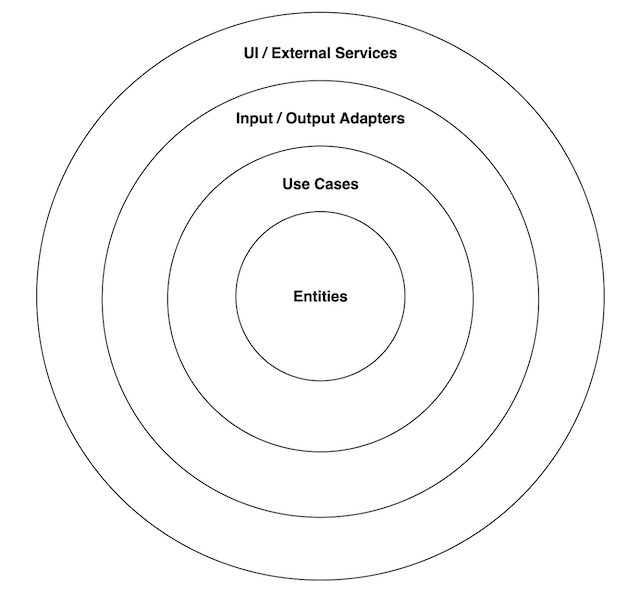
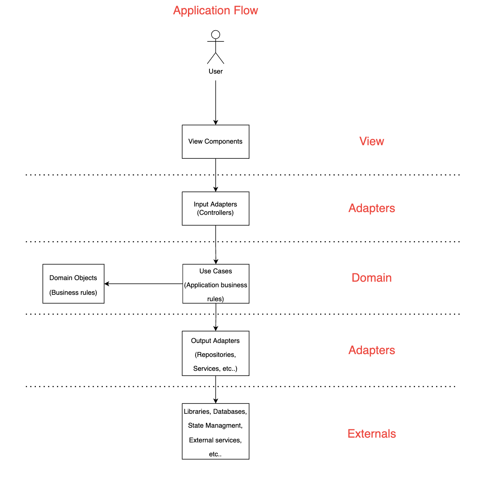
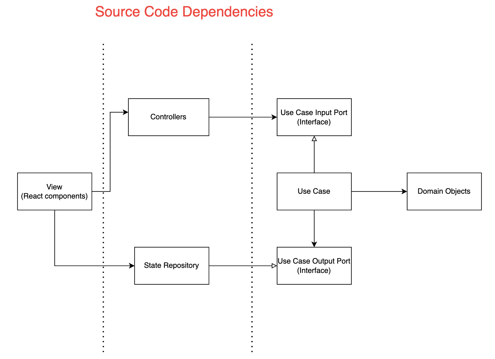
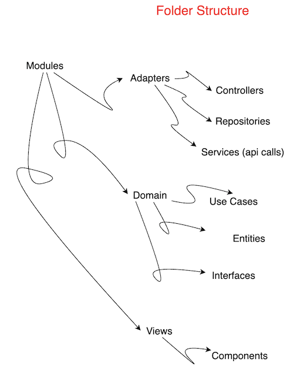

# Tik-TaK-Toe with clean architecture patterns

## Running the app

- Clone this repo
- Run _**npm install**_ in the console to install dependencies
- Run _**npm start**_ in the console to launch the application

## Clean architecture patterns applied to a React application
For this proposal we will develop an example application called Tik-Tak-Toe (also known as "Gato") to illustrate how to apply clean architecture patters to a React application.

## What is a clean architecture?
The main goal here is to build the core of our software isolated from any external dependencies like frameworks, drivers, databases, user interfaces and anything external.

The core of the software referes to the enterprice business rules and the application business rules.

The following diagram illustrates the layers we will consider for this proposal: 



**Entities**: This is where the entreprise business rules lives, here we will define objects that models that rules. This layer is completely isolated from the rest of the software so it's not affected by any external changes.

**Use Cases**: Application business rules. Represents users interactios with our software. In this layer we invoke the enterprise business rules through the entities. Output adapters like repositories are called from this layer.

**Adapters**: The adapters are responsible to isolate our use cases and entities from any externals.

**UI / External Services**: This layer represents any external tool like React, authentication services, databases, etc.

The following article by Robert C. Martin is a very nice starting point to what clean architecture refers to: https://blog.cleancoder.com/uncle-bob/2012/08/13/the-clean-architecture.html.

If you want to go deeper on what clean architecture is, I will encourage you to read the following book also by Robert C. Martin **Clean architecture: a craftsman's guide to software structure and design.**

## Why to use a clean architecture?
As sofware engineers, our role is to build quality sofware that saves resources to the company, that means software that tolerate changes over time reducing cost maitenance and this kind of architecture is the best to achieve that because it meets the following properties:

- **Testability**: The most important layer of our software, the domain layer, is very easy to test because it has no dependencies. Also given the fact that we are using a defined structure for the application, it's not hard to define mocks for the layers that has dependencies.
- **Decoupling**: If it's well designed, most layers should be decoupled from each other.
- **Parallel work**: Using the power of interfaces, developers can work on different layers of the software at the same time, of course this require a very disciplinated and well design architecture.
- **DDD**: By isolating the domain, we can apply DDD in it's pure form on applications with a very complex domain.
- **Scalability and Maintainability**: It's easy to change technologies like libraries or databases because the core of the software is not coupled to this details.
- **Easy to read**: By being disciplined and aware of the responsibilities of each layer, we should know very well where each piece of code lives.

## Applying clean architecture patterns to a React application
In this section we will review how we can apply clean architecture patterns to a React application.

Please take a look at the following diagram:



As you can see here, the components with which the user interacts calls the controllers which calls the use cases which calls output adapters wich calls external resources. To this point you might be wonder how to isolate the domain from the output adapters?

The Dependency Inversion Principle (DIP) is the way to go here. The DIP says that our high level layers should not depend on any lower level layer, so how do we get rid of the dependency with the output adapters? We have to declare an abstraction layer that  defines the requirements of the high level modules.

Please note in the following diagram how the use case exposes it's requirements through an interface and the repository implements it, inverting the dependency.



### Application folder structure
We will organize the code in modules and this modules will contains subfolders referencing the elements of our architecture so the folder structure will become an expression of the architecture.

#### Organicing in modules
We will organice the application in modules to because in this way it's easy to find every piece of code you need for a given change. For example if you need to add a functionality to the products module, you will know inmediatly where are all the files you need to edit to do the job.

It should be something like the diagram below:



Now we will start to analyse some parts of the code for each layer of the application:

### Domain
#### Entities
This is where the enterprice business rules lives, for purporses of our application, it will contains for example, the rules to make a movement and the rules that determine a winner. Let's take a look a the following code:

```typescript
type Board = {
  getFields: () => Array<Array<Field>>,
  move: (row: movement, col: movement) => void,
  checkWinner: () => number | undefined,
  getActivePlayer: () => number
};
```
We define a type that the board factory has to accomplish. The factory is just a function that returns an object with public methods to get or manipulate the internal state of the object.

If you are wondering why we are using factories instead of classes I will suggest you to read the following articles:

[article 1](https://javascript.plainenglish.io/why-factories-are-better-than-classes-in-javascript-1248b600b6d4)

[article 2](https://medium.com/programming-essentials/class-vs-factory-function-exploring-the-way-forward-73258b6a8d15)

Now let's move forward and take a look at the factory function makeBoard: 

```typescript
//src/tic-tac-toe/domain/entities/board.ts
import makeField, {Field} from './field';
export type movement = 0 | 1 | 2;

type Board = {
  getFields: () => Array<Array<Field>>,
  move: (row: movement, col: movement) => void,
  checkWinner: () => number | undefined
};

const makeBoard = (inputBoard : Array<Array<number | undefined>> | undefined = undefined) : Board => {
  // helper methods omitted

  const fields : Array<Array<Field>> = initFields();
  let activePlayer : number = initActivePlayer();

  const getFields = () => {
    return fields;
  };

  const getActivePlayer = () => {
    return activePlayer;
  };

  const move = (row: movement, col: movement) => {
    validateMovement(row, col);
    fields[row][col].setPlayer(activePlayer);
    changePlayer();
  };

  const checkWinner = () => {
    let winner;
    const DRAW = -1;

    winner = checkRows();
    if (winner) return winner;
    winner = checkColumns();
    if (winner) return winner;
    winner = checkDiagonals();
    if (winner) return winner;
    if (areAllFieldsTaken()) {
      return DRAW;
    }
 
    return undefined;
};

  return Object.freeze({
    getFields,
    move,
    checkWinner,
    getActivePlayer
  });
};

export default makeBoard;
```
As you can see, we defined two attributes for our board entity, activePlayer to keep track of the active player and fields that is a square matrix of fields entity which both are modified by the exposed methods.

Please note that this entity has 0 dependencies with outer layers so it's very easy to tests and it's not affected by external changes. This is exactly what we are looking for with this kind of architecture.

#### Use Cases
This layer represents user's interactions with the system, this is where the application business rules lives. Before continue, let's take a look about what a use case should do:

- Validate input
- Build the entities and manipulate the model through them
- Define interfaces
- Call the output adapters
- Return output (in our context this will be not necessary, we will see it later)

Considering our Tik-Tak-Toe game, we can easily identify two use cases:

- Start a game
- Make a movement

Let's see the following code of the movement use case:

```typescript
//src/tic-tac-toe/domain/use-cases/movement.ts
import makeBoard, {movement} from 'tic-tac-toe/domain/entities/board';
import type {Field} from 'tic-tac-toe/domain/entities/field';
 
export interface MovementUseCase {
 executeMovement: (number: number, board: Array<Array<number | undefined>>) => void
}
 
export interface UpdateBoardPort {
  updateBoard: (fields: Array<Array<Field>>, activePlayer: number | undefined, winner: number | undefined) => void
}
 
const makeMovement = (boardStateRepository: UpdateBoardPort): MovementUseCase => {
  const executeMovement = (number: number, board: Array<Array<number | undefined>>) => {
    // validate the input
    const newBoard = makeBoard(board);
    try {
      // this helper method is omitted
      const {row, col} = numberToMatrix(number, board);
      newBoard.move(row as movement, col as movement);
      const winner = newBoard.checkWinner();
      boardStateRepository.updateBoard(newBoard.getFields(), newBoard.getActivePlayer(), winner);
    } catch (error: any) {
      console.log(error.message);
    }
  };
 
  return {
    executeMovement
  };
};
 
export default makeMovement;
```
Please note the following:

- The use case depends directly on entities.
- There are two interfaces, one to invert the dependency against the flow control (output adapter that will implement the repository) and one to demarcate the entry points of the application core.
- The factory function for the use case receives the dependencies in it's arguments (dependency injection).
- The output adapter is called from the use case through the interface.
- There is no need to return a value because of the React context of this application, we will talk about this in the implementation of the repository.

Aditionally, there is a interfaces folder in the domain layer, this is where we declare the interfaces that will extends the interfaces declared in the use cases in order to be implemented by the corresponding output adapter. Each use case only declares interfaces with methods that it needs, we don't want the use cases to depends on methods that will don't need (interface segregation principle).

```typescript
//src/tic-tac-toe/domain/interfaces/boardStateRepository.ts
import {UpdateBoardPort} from 'tic-tac-toe/domain/use-cases/movement';
import {StartGamePort} from 'tic-tac-toe/domain/use-cases/startGame';
 
export interface BoardStateRepository extends UpdateBoardPort, StartGamePort {
  finishGame: () => void
  getIsGameStarted: () => boolean;
  getBoard: () => Array<Array<string>> | undefined;
  getActivePlayer: () => number | undefined;
  getWinner: () => number | undefined;
}
```
### Adapters
This layer is intended to isolate the domain from any externals like the UI, databases, APIs, etc.

#### Repository
This object will implements the interface declared above, here we will start to use React related code:

```typescript
//src/tic-tac-toe/domain/interfaces/boardStateRepository.ts
import {useState} from 'react';
import {Field} from 'tic-tac-toe/domain/entities/field';
import {BoardStateRepository} from 'tic-tac-toe/domain/interfaces/boardStateRepository';
 
type StateBoard = Array<Array<string>>;
 
const useBoardReactStateRepository = (): BoardStateRepository => {
  const [isStarted, setIsStarted] = useState<boolean>(false);
  const [board, setBoard] = useState<StateBoard>();
  const [activePlayer, setActivePlayer] = useState<number | undefined>();
  const [winningPlayer, setWinningPlayer] = useState<number | undefined>();
 
  const startGame = (fields: Array<Array<Field>>) => {
    setIsStarted(true);
    setBoard(mapDomainBoardToState(fields));
    setActivePlayer(1);
    setWinningPlayer(undefined);
  };
 
  const updateBoard = (
    fields: Array<Array<Field>>,
    activePlayer: number | undefined, winner: number | undefined
  ): void => {
    // omitted method
    setBoard(mapDomainBoardToState(fields));
    setActivePlayer(activePlayer);
    if (winner) {
      setWinningPlayer(winner);
    }
  };
 
  const finishGame = () => {
    setIsStarted(false);
  };
 
  const getIsGameStarted = () => isStarted;
 
  const getBoard = () => board;
 
  const getActivePlayer = () => activePlayer;
 
  const getWinner = () => winningPlayer;
 
  return {
    getIsGameStarted,
    startGame,
    finishGame,
    getBoard,
    updateBoard,
    getActivePlayer,
    getWinner
  };
};
 
export default useBoardReactStateRepository;
```

As you can see, the repository is a custom React hook that will encapsulate the interactions with the state of the application, isolating the domain from React related code. Something important here is we are mapping the input received from the use case to an internal data structure before store it in the state of the application, we don't want to be tempted to modify the domain because of something related to an external. Another important thing here is that the change of the state of the application will automatically generate a re render, this is why we don't need to return any value from the use case or the repository.

#### Controllers
The object described above is an output adapter, but what about the input adapter? This is where the controllers comes to play because we still need a way to isolate the entry points of the domain from the React related code. The controllers are what will be called from the React components upon users interactions. Let's take a look to the responsibilities in our context of the controller:
- Take the input
- Validate the input
- Build the data structures required by the use case
- Invoke the use case through the interface

So let's get right to the point:

```typescript
//src/tic-tac-toe/adapters/controllers/movementController.ts
import {MovementUseCase} from 'tic-tac-toe/domain/use-cases/movement';

const makeMovementController = (movementUseCase : MovementUseCase) => (
  fieldNumber: number, board: Array<Array<string>>
) => {
  // input validations
  // helper method omitted
  movementUseCase.executeMovement(fieldNumber, buildBoard(board));
};

export default makeMovementController;
```

### The main React component

To this point, we have been implementing the different layers of our application but who builds each layer and provides the objects implementing the interfaces? For this case, it will be the index entry point. This is a file with direct dependencies with each layer of the application, let's take a look at it:

```typescript
src/index.tsx
import React, {useEffect, useState} from 'react';
import ReactDOM from 'react-dom';

import useBoardStateRepository from 'tic-tac-toe/adapters/repositories/boardReactStateRepository';
import useUserStateRepository from 'user/adapters/repositories/userReactStateRepository';

import makeMovementUseCase from 'tic-tac-toe/domain/use-cases/movement';
import makeStartGameUseCase from 'tic-tac-toe/domain/use-cases/startGame';
import makeLoginUseCase from 'user/domain/use-cases/login';

import makeStartGameController from 'tic-tac-toe/adapters/controllers/startGameController';
import makeMovementController from 'tic-tac-toe/adapters/controllers/movementController';
import makeLoginController from 'user/adapters/controllers/loginController';

import TicTactToeView from 'tic-tac-toe/views/components/tic-tac-toe-view';
import makeLoginService from 'user/adapters/services/login';

type MainControllers = {
  startGameController: () => void,
  movementController: (number: number, board: Array<Array<string>>, activePlayer: number) => void,
  loginController: () => void
}

const Main: React.FC = () => {
  const stateBoardRepository = useBoardStateRepository();
  const stateUserRepository = useUserStateRepository();
  const [controllers, setControllers] = useState<MainControllers>();

  useEffect(() => {
    const loginService = makeLoginService();

    const startGameUseCase = makeStartGameUseCase(stateBoardRepository);
    const movementUseCase = makeMovementUseCase(stateBoardRepository);
    const loginUseCase = makeLoginUseCase(loginService, stateUserRepository);

    const startGameController = makeStartGameController(startGameUseCase);
    const movementController = makeMovementController(movementUseCase);
    const loginController = makeLoginController(loginUseCase);

    setControllers({
      startGameController,
      movementController,
      loginController
    });
  }, []);

  const currentState = {
    user: stateUserRepository.getUser(),
    isLoading: stateUserRepository.getIsLoading(),
    isGameStarted: stateBoardRepository.getIsGameStarted(),
    winner: stateBoardRepository.getWinner(),
    board: stateBoardRepository.getBoard(),
    activePlayer: stateBoardRepository.getActivePlayer()
  };

  if (controllers) {
    return <TicTactToeView
      login={controllers.loginController}
      startGame={controllers.startGameController}
      executeMovement={controllers.movementController}
      state={currentState}
    />;
  }
  return null;
};

ReactDOM.render(
  <React.StrictMode>
    <Main/>
  </React.StrictMode>,
  document.getElementById('root')
);
```
Note that we are ussing the useEffect React hook to build the different layers just one time, when the application is started or in other words, when the main React component is mounted. Another important fact to note is that here we are taking the state from the repository and passing it along with the controllers to the TicTacToeView component.

### What's next?
- An example for a external service adapter, what if we want to consume an external api?
- Routing, how do we handle routing in a React app?
- Shortcuts, is it necessary to go through of all this layers when we have a simple user interaction with the UI (no calls to external services and no manipulation of the domain)?
- Testing! How to apply TDD to this kind of architecture and what tools we can use?
